<!-- animated contribution graph: real data, boxes reveal cell by cell
     (regenerated daily by .github/workflows/update-profile-art.yml) -->

<h3><code>youssef@github ~ $ ./contributions.sh</code></h3>

 
 

<!-- hero: monochrome ASCII portrait (types in) beside a neofetch-style info
     panel. both columns add up to the graph's 860 and come out the same height.
     regenerate portrait: python scripts/prep_photo.py && python scripts/make_ascii_svg.py
     info panel: python scripts/make_info_card.py -->

<h3><code>youssef@github ~ $ whoami</code></h3>

<table>
<tr>
<td valign="top"></td>
<td valign="top"></td>
</tr>
</table>

 
 

<h3><code>youssef@github ~ $ ./links.sh</code></h3>

<b>ML security · AI engineering</b>

 

